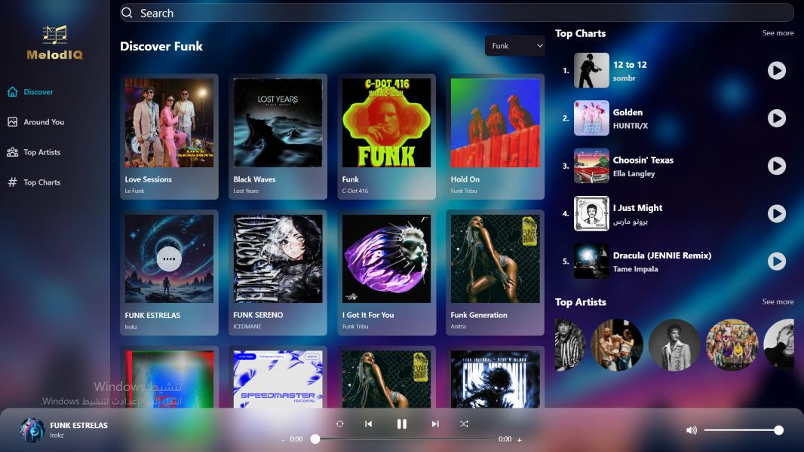

# Melodiq 🎵 — Music Streaming Web App

> A full-featured music streaming application built with React 18 and Redux Toolkit, powered entirely by free APIs with no credit card required.

---

## Description

Melodiq is a modern music streaming web app that lets you explore top charts, discover music by genre, browse artists, and listen to song previews — all powered by the free Deezer API. With a persistent music player, real-time lyrics, geolocation-based recommendations, and a sleek dark UI, Melodiq delivers a polished listening experience straight in the browser.

---

## Screenshot



---

## Live Demo

[melodiq.netlify.app](# https://melodiq.netlify.app/) 

---

## Features

- **Discover Page** — Browse up to 50 top global tracks with genre filtering (Pop, Hip Hop, Rock, Electronic, K-Pop, and more), displayed in a responsive card grid with instant play/pause.
- **Music Player** — A persistent bottom player with full controls: play/pause, skip forward/backward, shuffle, repeat, seekbar progress, and volume control — all powered by the HTML5 Audio API.
- **Song Details & Lyrics** — Dedicated song page showing album art, track info, real-time lyrics fetched from lyrics.ovh, and a related songs section from the same artist.
- **Top Charts** — Displays the 50 most-streamed tracks globally, updated on every visit thanks to disabled caching.
- **Top Artists** — Showcases the 50 most popular artists worldwide with photos and direct links to artist pages.
- **Artist Details** — Artist profile page showing cover photo, fan count, and their most popular tracks.
- **Around You** — Auto-detects the user's country via IP geolocation and displays trending tracks in their region.
- **Search** — Live search across the Deezer catalog returning both tracks and artists instantly.
- **Sidebar Navigation** — Clean collapsible sidebar with icon links to all pages.
- **Error & Loading States** — Graceful handling of API errors and loading skeletons throughout the app.

---

## Built With

| Technology | Purpose |
|---|---|
| **React 18** | UI library |
| **Vite** | Build tool & dev server |
| **Redux Toolkit** | Global state management |
| **RTK Query** | Server-state & data fetching |
| **React Router DOM v6** | Client-side routing |
| **Tailwind CSS** | Utility-first styling |
| **Swiper.js** | Touch-friendly carousels |
| **react-icons** | Icon library |
| **Deezer API** | Songs, artists, charts data |
| **lyrics.ovh API** | Song lyrics |
| **ipapi.co** | IP-based geolocation |

---

## What I Learned

This is my **second React project**. My first was **Crown Clothing**, built during the *Zero to Mastery — Complete React Developer 2026* course, which focused on React fundamentals, Context API, styled-components, and Firebase authentication.

### Key concepts I strengthened:

- **Redux Toolkit** architecture — slices, actions, selectors, and middleware in a real project
- **RTK Query** for all API calls — `createApi`, `fetchBaseQuery`, `transformResponse`, `keepUnusedDataFor`, and the `skip` option for dependent queries
- **Custom hooks pattern** — separating logic from UI cleanly in every component
- **Audio playback management** — using `useRef` + `useEffect` to control the HTML5 `<audio>` element reactively
- **Component composition** — building a full music player from small, reusable parts (Controls, Seekbar, VolumeBar, Track, Player)
- **CORS handling** — understanding browser security policies and using proxies during development
- **API error handling** — graceful 403/404 fallbacks and user-friendly error screens

---

## Getting Started Locally

```bash
# 1. Clone the repository
git clone https://github.com/your-username/melodiq.git

# 2. Navigate to the project folder
cd melodiq

# 3. Install dependencies
npm install

# 4. Start the development server
npm run dev
```
